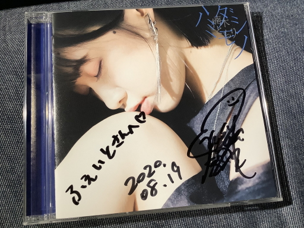

<table>
    <thead>
        <tr>
            <th>Tracklist</th>
        </tr>
    </thead>
    <tbody>
        <tr>
            <td>01. ハミダシモノ</td>
        </tr>
        <tr>
            <td>02. 眺めの空</td>
        </tr>
        <tr>
            <td>03. ロマンロン</td>
        </tr>
        <tr>
            <td>04. 僕の見る世界、君の見る世界</td>
        </tr>
        <tr>
            <td>05. ハミダシモノ -Instrumental-</td>
        </tr>
        <tr>
            <td>06. 眺めの空 -Instrumental-</td>
        </tr>
        <tr>
            <td>07. ロマンロン -Instrumental-</td>
        </tr>
        <tr>
            <td>08. 僕の見る世界、君の見る世界 -Instrumental-</td>
        </tr>
    </tbody>
</table>

ついに、この方のメジャーデビューの日が来ましたね。

僕が「楠木ともり」の名前を知ったのはアニメ[メルヘン・メドヘン](https://maerchen-anime.com/)。
OP:fhána、ED:上田麗奈さん、劇伴:rionosさんと僕を狙い撃ちにしてるとしか思えない音楽制作陣だったので
放送前からとても楽しみにしていたわけですが、そこで鍵村葉月の声を聴いて。
葉月の弱さと強さが同居した真っ直ぐなお芝居が刺さって、それ以来ずっと気になる声優さんでした。

それからラジオ([#ともらじ](https://www.onsen.ag/program/tomoradi/)とか)も聴くようになり、
ご本人がかなりの音楽ファンで、作詞作曲もされるというのを知って音楽活動の方にも興味を持ちました。
そこで[眺めの空](https://www.youtube.com/watch?v=Hjnx2_ejF5Y)を聴いてみたわけですが、いやもう衝撃でしたね…！
しかも初めて作詞作曲された曲だとか。
とても好きな系統の曲なのもあり、「すっっっごい才能だなぁ……」と一気に惚れ込んでしまって、
アーティスト活動を本格始動させるタイミングを今か今かと待っていました。

2019年12月にメジャーデビュー発表の告知を見たときには「いよいよ来るな……！！」と気持ちが高まるのを感じました。
そして[ロマンロン](https://www.youtube.com/watch?v=hOyDpI1XwgM)、[僕の見る世界、君の見る世界](https://www.youtube.com/watch?v=flso-7QjrH4)のLyric Video公開を経て、
、1st EPとなる本作[ハミダシモノ](https://www.kusunokitomori.com/discography/archive/?id=VVCL-1660)を満を持してリリース。
「ここからアーティスト"楠木ともり"が始まるんだな……！」と発売が待ち遠しくてしょうがなかったです。
しかも**作編曲・サウンドプロデュースには僕が大ファンの作編曲家[重永亮介](https://twitter.com/R_Shigenaga)さん。**
もう純粋に楽曲としてもメチャクチャ楽しみでした。

本作は表題曲"ハミダシモノ"+先に挙げた3曲のリアレンジ・リレコーディングVerの全4曲(+各曲のインストVer)ですが、とにかく音楽的に"濃すぎる"1枚……！！
重永さんが全曲に絡んでいるだけあって、「ピアノが印象的なロック」が共通項になっていますが、
4曲とも曲調が違っていてかつ**曲構成とアレンジがめちゃくちゃテクニカル**で、聴いていてすっっっっっっごく楽しい。
ロックサウンドを志向している声優アーティストさんは昨今多いですが、「アップテンポ！ライヴ映え！」みたいなわかりやすい方向ではなく、
テクニカルで深く聴けば聴くほど楽器隊の凄さを味わえる音楽性を選択しているのが信頼しかない。
(一応補足しておくと本作の曲がライヴ映えしないかというと全くそんなことはなく、ともりさんとバンドの緻密なアンサンブルを感じながら生の音で体感するのがメチャクチャ楽しいだろうなと思います。
はやくライヴで聴きたい！！)

そして、なんと言ってもともりさんの歌と歌詞の表現ですよ。
抑揚などダイナミクスの緩急がかなりあって、**情感や情念をすごく感じる歌**。
ともりさんは好きなアーティストにさユりさんやハルカトミユキさんをよく挙げていますが、
感情の揺れを生々しく歌うところの表現はさユりさんに通ずるものを少し感じますね。
(僕もさユりさん好きだからそう感じるのかも)
そのお二方からの影響も感じさせつつ、リスナーとして聴いてきた音楽を咀嚼して **「楠木ともりの表現」を既に確立している感がある** のが凄い。
歌詞もどこか陰が差している感じがすごく好みで、特に「**負の感情を負の感情のまま肯定する**」ところがメチャクチャ刺さります。
「克服する」でも「共感する」でもないところがポイントだと思っていて、「その感情はそのまま持っていていいんだよ」と言ってもらえるのがすごく安心感ある。

ちなみにともりさんの好きな音楽についてはJOQRの音楽~~&ラーメン~~番組[楠木ともり The Music Reverie](https://twitter.com/tomori_tmr)にて濃く語られているので、ぜひ聴いてみていただければと。
音楽ファンの人が創る音楽には、その人の音楽に対する強いこだわりが表出していて個人的にすごく好きなんですが、
ともりさんの音楽にはご自身の好きな音楽の要素が詰め込まれているのが伝わってきて、同じ音楽ファンとしてとても嬉しくなりますね。

また、4曲ともInstrumental versionが収録されているのも特筆すべき点ですね。
楽器隊がすごく面白いことをやっている楽曲たちなので、インスト版でバッキングに注目しながら聴くのがすごく楽しい。
昨今シングルでもインスト版が収録される機会がどんどん減っていますが、
楽器隊に着目して聴く楽しさは間違いなくあると思うので、ともりさんの作品は今後もインストverを収録してほしいなぁと思いました。

ここからは各楽曲の感想をば。

## 01. ハミダシモノ

[魔王学院の不適合者](https://maohgakuin.com/)EDテーマ。
ジャズテイストを織り込んだミドルテンポのロック。とても良い曲です。
重永さんの鍵盤がまず印象的ですが、他の楽器も面白いフレーズ満載。
どの楽器に着目して聴いても面白いし、イントロとラスサビ前の鍵盤のフレーズが印象的。
あと**2番Aメロのベースラインがめちゃくちゃエロい**。無限に聴ける。
さらにもうひとつ推しポイントを挙げておくと、**2:57の歪ませまくったギター**がすっごい好きです(細かすぎて伝わらない)

「強さ」をテーマにしている歌詞もあって、ともりさんの歌も「多様な強さの在り方」を表現している感があってとても良い。
歌の表現的には**1番Aメロ～Bメロ前半のウィスパーからパワーヴォーカルにスイッチする**ところがすごく好き。
歌詞だと「自分を貫け」のところが僕の「強さ」像とリンクするところがあってとても刺さります。

音源で聴くのももちろんだけど、ライヴハウスで聴くとすっっっっっごく気持ちよさそうな曲なんですよねぇ。
バンドの緻密なアンサンブルと、ともりさんの情感のこもった歌に浸りながら音に身を委ねたい。

## 02. 眺めの空

「夏の終わり」を感じさせる叙情的な曲。
「bottled-up」のアコースティックverは「寂しさ」を感じさせる比較的綺麗なアレンジだったけど、こちらのバンドVerはより「どうしようもない感情」がダイレクトに伝わってくるアレンジ。
**「あぁ くらくらする」の裏で鳴っているギターから歌詞にちらつく暴力的な感情**を感じてすごく好きです。
あとAメロの鍵盤コード弾きとガットギターの組合せがなんか好き。
伴奏に注目して聴きたくなる感覚があって、インスト版もよく聴いてます。
初めて聴いたときからメロディと歌詞がすごく刺さってしまったんだけど、**夏の終わりの寂寥感と同時にどうしようもなく燻る感情に満たされる感覚**がメチャクチャ好きなんだよなぁ。

オンラインアコースティックライヴでラスサビ前の「だから」のフレーズを溜めに溜めて歌っていたのがすごく良かった。現地で生の音で体感したい。

## 03. ロマンロン

変拍子ありのプログレッシヴな曲展開が印象的な曲。
こちらは「STROKE」収録版と大まかな構成は同じで、アップデート版みたいな感じですが、**重永さんのアレンジで化けたな～と感じました**。
重永さんの鍵盤の音色が曲とすごくマッチしていて、聴いていてすごく心地よい。某「MPが回復しない音」とか音に遊びが入ってるのも。

とにかく面白い曲なんですよね。
AメロとBメロとサビでリズムが全然違って、曲の展開とともに印象が大きく変わるのが面白い。
特にサビで一気に疾走感が増すのが好き。
歌詞もサビの「ロマンロン」と「不安感」の韻踏みとか、不安定な感じがすごく気持ちよくていくらでも聴いていられる。
「あたためてくれる場所」の裏で鳴ってるエフェクトかけまくりギターがとても好きです。

## 04. 僕の見る世界、君の見る世界

ともりさんと重永さんの最初の共作曲曲。
「眺めの空」「ロマンロン」とはだいぶテイストが異なっていて、爽やかな初夏を思わせる音と空気感が心地よい。
この曲もともりさんの「表現のスイッチング」が良いですね(Aメロのウィスパーな歌い方 → Aメロ終わりからの力強い歌い方)
あと「tu tu tu tu lu…」のフレーズ。すごく耳馴染みがよくて気持ち良い。
知らない街を歩きながら聴きたい曲。

CD収録Verもとても好きですが、オンラインアコースティックライヴで披露されたしっとりアコースティックVerがすごく素敵なアレンジになっていたので、
いつか来るであろうライヴの時にもまたあのアレンジで聴きたいな。

## おわりに

満を持して世に送り出された「アーティスト楠木ともり」の最初の一歩。
その一歩目は、「本当にデビュー作ですか？？？」と思わず言いたくなってしまうくらい、
たいへんに完成度の高いロック作品で、楽しみで楽しみでしょうがなかった、その期待感をさらに超えるクオリティ。
そして自分の音楽的嗜好に刺さりまくる楽曲を届けてくれたのが本当に嬉しい。
純粋な音楽性で見ると、今まで聴いてきた声優アーティストの作品で一番好みかもしれないです。
(個人的には楠木ともりさんは"声優アーティスト"ではなく"アーティスト"になるんだろうな、と思っていますが、ここでは便宜上"声優アーティスト"の言葉を使わせていただきます)

今回は重永さんと組んでの作品になったわけですが、今後色んなアレンジャーさんと組んで色んな方向性の音楽を聴いてみたいですね。
そして、これはご本人も仰っていますが「**作詞・作曲：楠木ともり でタイアップ**」を早い段階で見てみたい。
(個人的にはそう遠くないうちに実現するんじゃないかと思っていますが)
最後に、少し気が早いことを書いてしまいますが、**1stアルバムでどれだけのものを聴かせてくれるのか、今からワクワクが止まりません！**

オンラインサイン会にも参加し、久しぶりに名前入りサインをいただきました。大切にします。
