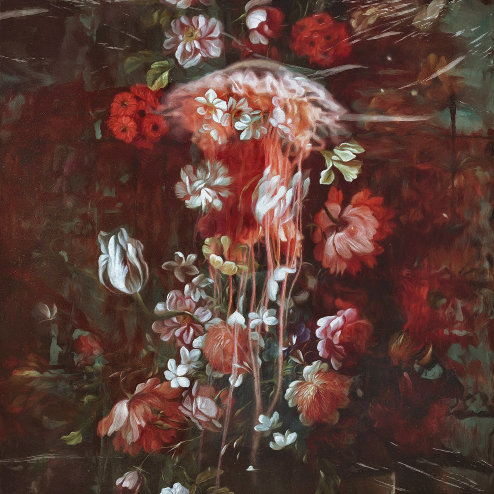

<section>
    

        
    

    

        

            <table>
                <tbody>
                    <tr><td>Artist</td><td><a href="https://unreqvited.bandcamp.com/">Unreqvited</a></td></td>
                    <tr><td>Title</td><td>Beautiful Ghosts</td></td>
                    <tr><td>Label</td><td>Prophecy Productions</td></td>
                    <tr><td>Release Date</td><td>2021/08/13</td></td>
                    <tr><td>Genre</td><td>Metal</td></td>
                    <tr><td>Country</td><td>Canada</td></td>
                </tbody>
            </table>
        

        

            <table>
                <thead>
                    <tr><th>Tracklist</th></tr>
                </thead>
                <tbody>
                    <tr><td>01</td><td>All is Lost</td></tr>
                    <tr><td>02</td><td>Autumn & Everley</td></tr>
                    <tr><td>03</td><td>Reverie</td></tr>
                    <tr><td>04</td><td>Funeral Pyre</td></tr>
                    <tr><td>05</td><td>Cherish</td></tr>
                    <tr><td>06</td><td>Beautiful Ghosts</td></tr>
                    <tr><td>07</td><td>All is Found</td></tr>
                </tbody>
            </table>
        

    

</section>

[Bandcamp](https://unreqvited.bandcamp.com/album/beautiful-ghosts)

カナダの鬼氏によるAtmospheric/Depressive Post-Blackプロジェクト、6thアルバム。
Post-BlackやBlackgaze的なノリのアルバムとアンビエントにかなり近いアルバム両方をDiscographyにもつこのUnreqvitedですが、
前作[Empathica](https://unreqvited.bandcamp.com/album/empathica)がシンフォニック・アンビエント的な作風だったのに対し、今作は幾分かメタル側に寄った音像に。
特にT01“**All is Lost**”はImsomniumやSentenced的なMelancholic Metalな作風になっており今までなかった芸風。
灰色の荒野感あるリフが性癖に刺さりすぎるのもあって永遠に聴いていたくなる佳曲。
とりあえず聴いてくれ。

<iframe src="https://open.spotify.com/embed/track/4BwhTHj5eAkgKG4zCHdCVR" width="100%" height="380" frameBorder="0" allowtransparency="true" allow="encrypted-media"></iframe>

シンフォブラック的なT2“**Autumn & Everley**”、
朴訥なクリーンVo.が印象的なアンビエント・トラックT3“**Reverie**”、
鍵盤の音が美しいBlackgaze的なスローチューンT4“**Funeral Pyre**”、
ピアノ＆オケメインのinterlude T5“**Cherish**”を挟んでの、
環境音やピアノといったアンビエント的要素と内省的Melancholic Metalが融合したタイトルチューンT6“**Beautiful Ghosts**”でクライマックスを迎え、
曲名もT1の対になっている、救いや光を見いだせる柔らかい音像のT7“**All is Found**”

とメタルとアンビエントを行き来しながら、心の中にある原風景を想起させるAmbient Metalは聴いていてとても心地よいし聴きやすい。
いわゆる「歌詞」というものが存在せず、ヴォーカルはひたすら感情を叫んでいるスタイルなのも生の感情をそのままぶつけられている感があって好き。
歌詞がある「歌」まではいっていないのが、インスト的に聴けるのも良いですね。

どこかノスタルジーも感じる懐かしい音像で、非常に安心感をもって聴ける1枚です。
メタルファンのみならずアンビエント好きにも訴求しそうだし、メタルには珍しい“優しさ”を感じられるアルバム。
